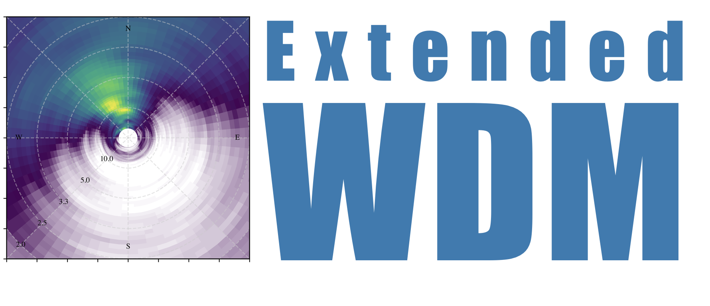
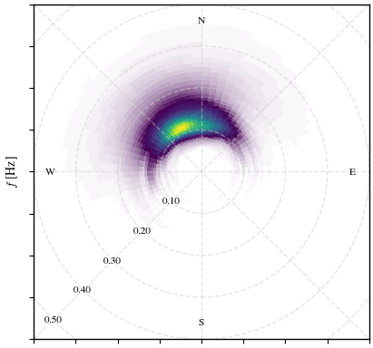

[](https://extended-wdm.readthedocs.io/en/latest/?badge=latest)
[](https://github.com/dspelaez/extended-wdm/actions/workflows/python-package.yml)



# EWDM: Extended Wavelet Directional Method

Welcome to the GitHub repository for the Extended Wavelet Directional Method
(EWDM) - a toolkit for estimating directional spectra  of ocean waves using the
Continuous Wavelet Transform (CWT).

This algorithm is an extension of the original WDM proposed by [Donelan et al.
(1985)](10.1175/1520-0485(1996)026<1901:naotdp>2.0.co;2) that was only suitable
for spatially-distributed arrays of wave staffs. This extension allows the
estimation of the directional wave spectrum for GPS wave buoys, pitch-roll-heave
buoys and Acoustic Doppler Current Profilers.

The wavelet-based methods have emerged as a practical alternative to the
conventional Fourier-based techniques, particularly well-suited for the analysis
of data from [Spotter buoys](https://www.sofarocean.com/products/spotter) as
demonstrated by [Peláez-Zapata et al.
2024](https://doi.org/10.1175/JTECH-D-23-0058.1) and from other triplet data
such as wave slopes as shown by [Krogstad et al.
2006](https://onepetro.org/IJOPE/article-abstract/28936/Wavelet-And-Local-Directional-Analysis-of-Ocean?redirectedFrom=fulltext).

Key features of the EWDM include:

* Implementation of the wavelet-based algorithms for extracting directional
  information from wave time series.
* Tools for processing and visualising directional wave data.
* Powered by `xarray` labelled multi-dimensional arrays.
* Helper functions to handle commonly used data sources such as 
  [Spotter buoys](https://www.sofarocean.com/products/spotter) and
  [CDIP](https://cdip.ucsd.edu/).
* Documentation, examples, and comparison with conventional methods.


Whether you are a researcher, student, or engineer in physical oceanography, the
Extended Wavelet Directional Method provides a powerful, user-friendly toolkit
for in-depth analysis of directional ocean wave spectra. Join us in exploring
the fascinating world of directional wave analysis and making meaningful
contributions to the understanding of ocean wave dynamics. We welcome
contributions, feedback, and collaboration from the community to further enhance
the capabilities of the Extended Wavelet Directional Method.

# Getting Started

## Installation

Package installation can be done using pip. First, make sure you have Python 3.8
or higher installed.

```bash
pip install ewdm
```

This will install the `ewdm` package along with its dependencies.


## Usage

After installation, you can import and use the `ewdm` package in your Python
code:


```python
import ewdm
```

## Quick example

This example uses a CDIP buoy time series of wave-induced displacements to
estimate the directional wave spectrum.

```python
import numpy as np
import xarray as xr
from matplotlib import pyplot as plt

import ewdm
from ewdm.sources import CDIPDataSourceRealTime
from ewdm.plots import plot_directional_spectrum
plt.ion()

cdip =  CDIPDataSourceRealTime(166)
dataset = cdip.read_dataset(time_start='2024-06-09T08:30')
spec = ewdm.Triplets(dataset)
output = spec.compute()

fig, ax = plt.subplots()
plot_directional_spectrum(
    output["directional_spectrum"], ax=ax, levels=None
)
```

This will produce a plot like this:




## Further examples

Consult the full documentation on [extended-wdm.readthedocs.io/](extended-wdm.readthedocs.io/)

