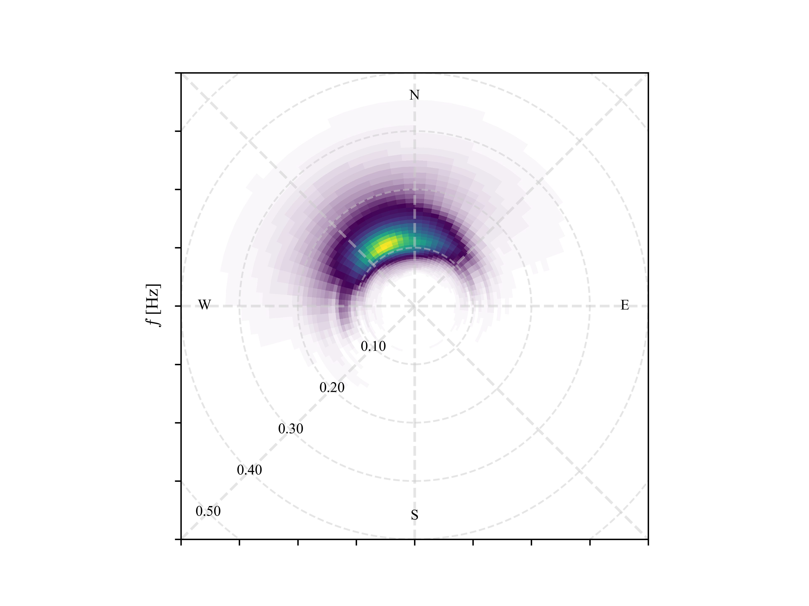

[](https://extended-wdm.readthedocs.io/en/latest/?badge=latest)
[](https://github.com/dspelaez/extended-wdm/actions/workflows/python-package.yml)
[](https://badge.fury.io/py/ewdm)
[](https://mybinder.org/v2/gh/dspelaez/extended-wdm/HEAD?labpath=notebooks)
[](https://zenodo.org/doi/10.5281/zenodo.12805994)
[](https://joss.theoj.org/papers/3b59fa36efc62a871bfd48acb056670d)


# EWDM: Extended Wavelet Directional Method

Welcome to the GitHub repository for the **Extended Wavelet Directional Method (EWDM)** - a toolkit for estimating directional spectra of ocean waves using the Continuous Wavelet Transform (CWT).

This package implements the algorithms of the original WDM proposed by [Donelan et al. (1985)](10.1175/1520-0485(1996)026<1901:naotdp>2.0.co;2) that are suitable for spatially-distributed arrays of wave staffs; as well as the algorithms presented by [Peláez-Zapata et al. (2024)](https://doi.org/10.1175/JTECH-D-23-0058.1) for single-point triplets of wave-induced displacements, velocities, accelerations or slopes (see also [Krogstad et al., 2006](https://onepetro.org/IJOPE/article-abstract/28936/Wavelet-And-Local-Directional-Analysis-of-Ocean?redirectedFrom=fulltext)).

Therefore, **EWDM** allows the estimation of the directional wave spectrum for a variety of sources, including GPS-based buoys, pitch-roll-heave buoys, acoustic Doppler current profilers (ADCPs) and sampled points from stereo-imaging recordings.


**Key features** of the **EWDM** include:

* Implementation of the wavelet-based algorithms for extracting directional
  information from wave time series.
* Tools for processing and visualising directional wave data.
* Powered by `xarray` labelled multi-dimensional arrays.
* Helper functions to handle commonly used data sources such as
  [Spotter buoys](https://www.sofarocean.com/products/spotter) and
  [CDIP](https://cdip.ucsd.edu/).
* Documentation, examples, and comparison with conventional methods.


Whether you are a researcher, student, or engineer in physical oceanography, **EWDM** provides a powerful, user-friendly toolkit for in-depth analysis of directional ocean wave spectra. We welcome contributions, feedback, and collaboration from the community to further enhance the capabilities of **EWDM**.


# Getting Started

## Installation

### Stable release

You can install EWDM using `pip`. First, make sure you have Python 3.8 or higher installed.

```bash
pip install ewdm
```

This is the preferred method to install EWDM, as it will always install the most recent stable release.

If you don't have `pip` installed, these [Python installation instructions](http://docs.python-guide.org/en/latest/starting/installation/) can guide
you through the process.


### From sources

The sources for EWDM can be downloaded from the [Github repo](https://github.com/dspelaez/extended-wdm).

You can either clone the public repository:

```bash
git clone git://github.com/dspelaez/extended-wdm
```

Or download the [tarball](https://github.com/dspelaez/extended-wdm/tarball/master):

```bash
curl -OJL https://github.com/dspelaez/extended-wdm/tarball/master
```

Once you have a copy of the source, you can install it with:

```bash
python setup.py install
```

Or using `pip`:

```bash
pip install .
```


## Running tests

To install the necessary packages for development and testing, you can run the following command:

```bash
pip install -e '.[test]'
```

To run the tests, you can use the `pytest` framework by executing the following command:
```bash
pytest tests
```


## Usage

After installation, you can import and use the `ewdm` package in your Python code:

```python
import ewdm
```

## Quick example

This example uses a CDIP buoy time series of wave-induced displacements to estimate the directional wave spectrum.

```python
import numpy as np
import xarray as xr
from matplotlib import pyplot as plt

import ewdm
from ewdm.sources import CDIPDataSourceRealTime
from ewdm.plots import plot_directional_spectrum
plt.ion()

cdip =  CDIPDataSourceRealTime(166)
dataset = cdip.read_dataset(time_start='2024-06-09T08:30')
spec = ewdm.Triplets(dataset)
output = spec.compute()

fig, ax = plt.subplots()
plot_directional_spectrum(
    output["directional_spectrum"], ax=ax, levels=None
)
```

This will produce a plot like this:




## Further examples

For a curated collection of examples, please refer to the [Gallery](https://extended-wdm.readthedocs.io/en/latest/gallery.html) in the documentation.


## Related projects

Several tools complement the functionality of **EWDM** in the analysis of ocean
wave data. Some of the most relevant projects are:

- [`WAFO`](https://www.maths.lth.se/matstat/wafo/) provides advanced statistical
  and engineering analysis of wave fields and wave-induced loads.

- [`FOWD`](https://github.com/dionhaefner/FOWD) offers a rich dataset of wave
  parameters tailored for machine learning applications. It also provides
  routines to compute frequently used wave parameters.

- [`DIWASP`](https://github.com/metocean/diwasp) implements classical
  Fourier-based methods for directional spectrum estimation.

- Special mention to modern Python packages like
  [`wavespectra`](https://github.com/wavespectra/wavespectra) and
  [`oceanwaves-python`](https://github.com/openearth/oceanwaves-python), that
  support spectral data manipulation and visualization. While these tools do not
  estimate directional spectra from raw measurements, they can be integrated
  with **EWDM** to enhance wave data processing workflows.


## How to cite this work

If you find this software useful, please cite it using the DOI: [`10.21105/joss.07942`](https://doi.org/10.21105/joss.07942) or copy the following `bibtex` entry:

```
@article{Pelaez-Zapata2025,
  doi = {10.21105/joss.07942},
  url = {https://doi.org/10.21105/joss.07942},
  year = {2025},
  publisher = {The Open Journal},
  volume = {10},
  number = {109},
  pages = {7942},
  author = {Daniel Peláez-Zapata and Frédéric Dias},
  title = {EWDM: A wavelet-based method for estimating directional spectra of ocean waves},
  journal = {Journal of Open Source Software}
}
```


## How to contribute

EWDM is an open-source package and we welcome feedback and contributions.

You can open an issue in the GitHub issues page if you:

- find a bug in the package;
- need some new features;
- want some supports;
- show your own examples.

Please refer to the [Contributing guide](https://extended-wdm.readthedocs.io/en/latest/contribute.html) in the documentation for further information.
