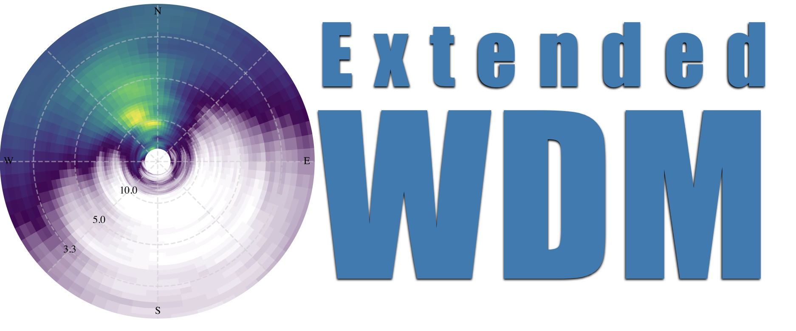

.. extended-wdm documentation master file, created by
   sphinx-quickstart on Thu Jun 27 21:31:51 2024.
   You can adapt this file completely to your liking, but it should at least
   contain the root `toctree` directive.

Welcome to extended-wdm package documentation!
==============================================

*EWDM (Extended Wavelet Directional Method) is a Python toolkit for a wavelet-based estimation of the directional wave spectra*

* The wavelet-based method for estimating directional wave spectra have emerged
  as a practical alternative to the conventional Fourier-based techniques.

* This package implements a wavelet-based technique to obtain a robust
  estimation of the directional wave spectrum from diverse source of data such
  as *GPS buoys*, *pitch-roll buoys*, *arrays of wave staffs* and *ADCPs*.

* For spatial arrays of wave staffs, the original `Donelan's`_ WDM (Wavelet
  Directional Method) is implemented.

* For single-point triplet data, such as wave buoys and ADCPs, the methods
  presented by `Pelaez-Zapata et al. (2024)`_ and `Krogstad et al. (2006)`_ are
  implemented.

* So, the package, "Extended Wavelet Directional Method," extends the original
  WDM to incorporate single-point triplet data in addition to wave arrays
   

.. note::

   **Key features of the EWDM include:**
      
   * Implementation of the wavelet-based algorithms for extracting directional
     information from wave time series.
   
   * Improve estimation of wave directional distribution using KDE (Kernel
     Density Estimation).
   
   * Tools for processing and visualising directional wave data.
   
   * Powered by `xarray` labelled multi-dimensional arrays.
   
   * Helper functions to handle commonly used data sources such as `SOFAR
     Spotter buoys`_ and `CDIP database`_.
   
   * Documentation, examples, and comparison with conventional methods.

.. _Donelan's: https://doi.org/10.1175/1520-0485(1996)026<1901:naotdp>2.0.co;2
.. _Pelaez-Zapata et al. (2024): https://doi.org/10.1175/JTECH-D-23-0058.1
.. _Krogstad et al. (2006): https://onepetro.org/IJOPE/article-abstract/28936/Wavelet-And-Local-Directional-Analysis-of-Ocean?redirectedFrom=fulltext
.. _SOFAR Spotter buoys: https://www.sofarocean.com/products/spotter
.. _CDIP database: https://cdip.ucsd.edu/

Whether you are a researcher, student, or engineer in physical oceanography, the
EWDM provides a powerful, user-friendly toolkit for estimating the directional
wave spectra. We welcome contributions, feedback, and collaboration from the
community to further enhance the capabilities of the Extended Wavelet
Directional Method.

.. warning::
   This is an experimental version.

.. toctree::
   :maxdepth: 2
   :caption: Contents:

   getting_started
   maths
   gallery

API Documentation
=================

.. toctree::
   :maxdepth: 2

   ewdm

Indices and tables
==================

* :ref:`genindex`
* :ref:`modindex`
* :ref:`search`
